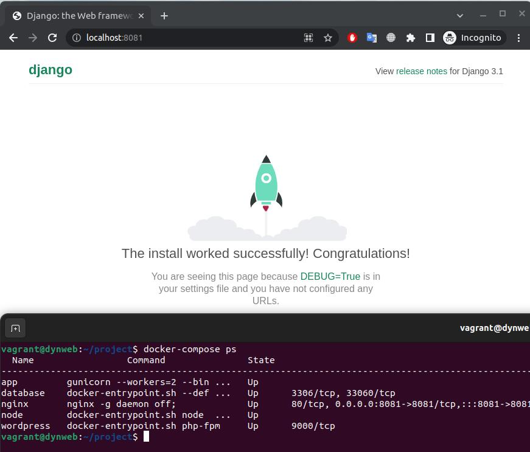
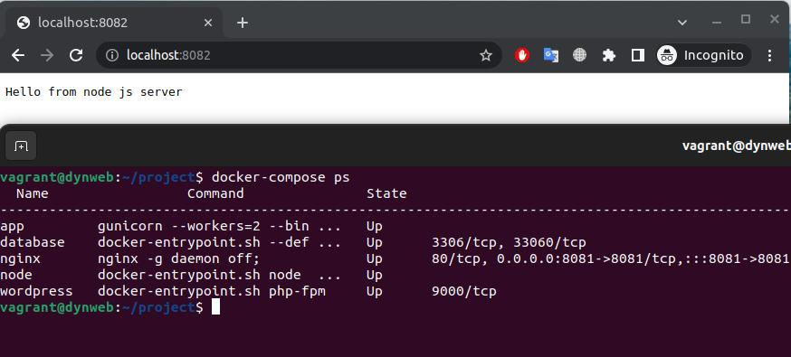
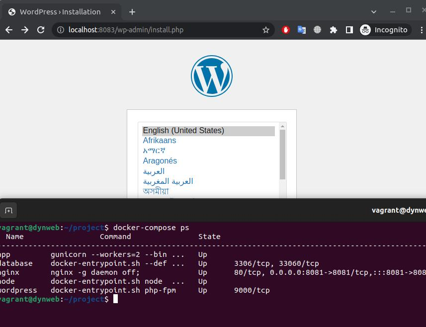

## lab41_Динамический веб
### С помощью Vagrant + Ansible развернут стенд: nginx + php-fpm (wordpress) + python (django) + js(node.js) с деплоем через docker-compose
Для развёртки wordpress выбран mysql

-----------------------------------------------------------------------------------------------------------------------

* __[Скрипт Vagrantfile:](./Vagrantfile)__
<details>

```
ENV['VAGRANT_SERVER_URL'] = 'https://vagrant.elab.pro'
MACHINES = {
  # Указываем имя ВМ "kernel update"
  :"dynweb" => {
              #Какой vm box будем использовать
              :box_name => "ubuntu/20.04",
              :ip_addr => '192.168.56.111',
              #Указываем количество ядер ВМ
              :cpus => 1,
              #Указываем количество ОЗУ в мегабайтах
              :memory => 1024,
            }
}

Vagrant.configure("2") do |config|
  MACHINES.each do |boxname, boxconfig|
    # Отключаем проброс общей папки в ВМ
    config.vm.synced_folder ".", "/vagrant", disabled: true
    config.vm.network "forwarded_port", guest: 8081, host: 8081
    config.vm.network "forwarded_port", guest: 8082, host: 8082
    config.vm.network "forwarded_port", guest: 8083, host: 8083
    # Применяем конфигурацию ВМ
    config.vm.define boxname do |box|
      box.vm.box = boxconfig[:box_name]
      box.vm.host_name = boxname.to_s
      box.vm.network "private_network", ip: boxconfig[:ip_addr]

      box.vm.provider "virtualbox" do |vb|
        vb.gui = false
        vb.memory = boxconfig[:memory]
        vb.cpus = boxconfig[:cpus]
        vb.customize ["modifyvm", :id, '--audio', 'none']
      end

    config.vm.provision "ansible" do |ansible|
      ansible.playbook = "prov.yml"
      end
    end
  end
end
```  

</details>
<br>

* __[Ansible-скрипт (provision):](./prov.yml)__
<details>

```
---
- name: Provision_dynweb
  hosts: dynweb
  become: yes
  gather_facts: false
  tasks:
    - name: Install docker packages
      become: yes
      apt:
        name: "{{ item }}"
        state: present
        update_cache: yes
      with_items:
      - apt-transport-https
      - ca-certificates
      - curl
      - software-properties-common
      tags:
        - docker
    - name: GPG-key_add
      become: yes
      apt_key:
        url: https://download.docker.com/linux/ubuntu/gpg
        state: present
      tags:
        - docker
    - name: Verify that we have the key with the fingerprint
      become: yes
      apt_key:
        id: 0EBFCD88
        state: present
      tags:
        - docker

    - name: Set up the stable repository
      become: yes
      apt_repository:
        repo: deb [arch=amd64] https://download.docker.com/linux/ubuntu xenial stable
        state: present
        update_cache: yes
      tags:
        - docker

    - name: Update apt packages
      become: yes
      apt:
        update_cache: yes
      tags:
        - docker

    - name: Install docker # установка докера
      become: yes
      apt:
        name: docker-ce
        state: present
        update_cache: yes
      tags:
        - docker

    - name: Add remote "vagrant" user to "docker" group
      become: yes
      user:
        name: vagrant
        group: "docker"
        append: yes
      tags:
        - docker

    - name: Install docker-compose
      become: yes
      get_url:
        url : https://github.com/docker/compose/releases/download/1.29.2/docker-compose-Linux-x86_64
        dest: /usr/local/bin/docker-compose
        mode: 0777
    
    - name: Copy project # Копируем проект с хост машины в созданную через vagrant
      copy: src=project dest=/home/vagrant

    - name: reset ssh connection # чтобы применились права на использование docker, необходимо перелогиниться
      meta: reset_connection
    
    - name: Run container
      shell:
        cmd: "docker-compose -f docker-compose.yml up -d"
        chdir: /home/vagrant/project
```        
</details>
<br>

* __[docker-compose.yml](./project/docker-compose.yml)__

<details>
<summary>Описание сервисов (database, wordpress, node, app, nginx:)</summary>

```
services:

  database:
    image: mysql:8.0.34 # используем готовый образ mysql от разработчиков
    container_name: database
    restart: unless-stopped
    environment:
      MYSQL_DATABASE: ${DB_NAME} # Имя и пароль базы данных будут задаваться в отдельном .env файле
      MYSQL_ROOT_PASSWORD: ${DB_ROOT_PASSWORD}
    volumes:
      - ./dbdata:/var/lib/mysql # Чтобы данные базы не пропали при
    command:
      '--default-authentication-plugin=caching_sha2_password'
    networks:
      - app-network
  wordpress:
    image: wordpress:6.2.2-fpm-alpine # официальный образ от разработчиков
    container_name: wordpress
    restart: unless-stopped
    environment:
      WORDPRESS_DB_HOST: database
      WORDPRESS_DB_NAME: "${DB_NAME}" # Также импортируем переменные из .env
      WORDPRESS_DB_USER: root
      WORDPRESS_DB_PASSWORD: "${DB_ROOT_PASSWORD}"
    volumes:
      - ./wordpress:/var/www/html # сохраняем приложение на хост машине
    networks:
      - app-network
    depends_on:
      - database # контейнер wordpress дождется запуска БД
  node:
    image: node:16.13.2-alpine3.15
    container_name: node
    working_dir: /opt/server # переназначим рабочую директорию для удобства
    volumes:
      - ./node:/opt/server # пробрасываем приложение в директорию контейнера
    command:
      node test.js # запуск приложения
    networks:
      - app-network
  app:
    build: ./python # для нашего приложения нужны зависимости, поэтому
    container_name: app
    restart: always
    env_file:
      - .env # импортируем в контейнер переменные из .env
    command:
      "gunicorn --workers=2 --bind=0.0.0.0:8000 mysite.wsgi:application"
    networks:
      - app-network
    
  nginx:
    image: nginx:1.15.12-alpine
    container_name: nginx
    restart: unless-stopped
    ports:
      - 8081:8081
      - 8082:8082
      - 8083:8083
    volumes:
      - ./wordpress:/var/www/html
      - ./nginx-conf:/etc/nginx/conf.d # монтируем конфиг
    networks:
      - app-network
    depends_on: # nginx будет запускаться после всех приложений
      - wordpress
      - node
      - app
networks:
  app-network:
    name: app-network
    driver: bridge

```
</details>
<br>

*  __[Dockerfile:](./project/python/Dockerfile)__
<details>

```
FROM python:3.8.3
ENV APP_ROOT /src
ENV CONFIG_ROOT /config
RUN mkdir ${CONFIG_ROOT}
COPY requirements.txt ${CONFIG_ROOT}/requirements.txt
RUN pip install -r ${CONFIG_ROOT}/requirements.txt
RUN mkdir ${APP_ROOT}
WORKDIR ${APP_ROOT}
ADD . ${APP_ROOT}
```
</details>
<br>

*  __[Конфиг Nginx:](./project/nginx-conf/nginx.conf)__
<details>

```
upstream django {
    server app:8000;
}
server {
# Django будет отображаться на 8081 порту хоста
    listen 8081;
    listen [::]:8081;
    server_name localhost;
    location / {
        try_files $uri @proxy_to_app;
    }
# тут используем обычное проксирование в контейнер django
location @proxy_to_app {
    proxy_pass http://django;
    proxy_http_version 1.1;
    proxy_set_header Upgrade $http_upgrade;
    proxy_set_header Connection "upgrade";
    proxy_redirect off;
    proxy_set_header Host $host;
    proxy_set_header X-Real-IP $remote_addr;
    proxy_set_header X-Forwarded-For $proxy_add_x_forwarded_for;
    proxy_set_header X-Forwarded-Host $server_name;
    }
}

# Node.js будет отображаться на 8082 порту хоста
server {
    listen 8082;
    listen [::]:8082;
    server_name localhost;
    location / {
        proxy_pass http://node:3000;
        proxy_http_version 1.1;
        proxy_set_header Upgrade $http_upgrade;
        proxy_set_header Connection "upgrade";
        proxy_redirect off;
        proxy_set_header Host $host;
        proxy_set_header X-Real-IP $remote_addr;
        proxy_set_header X-Forwarded-For $proxy_add_x_forwarded_for;
        proxy_set_header X-Forwarded-Host $server_name;
    }
}

# Данный сервер отвечает за проксирование на wordpress через fastcgi
server {
    # Wordpress будет отображаться на 8083 порту хоста
    listen 8083;
    listen [::]:8083;
    server_name localhost;
    index index.php index.html index.htm;
    # Задаем корень корень проекта, куда мы смонтировали статику wordpress
    root /var/www/html;
    location ~ /.well-known/acme-challenge {
        allow all;
        root /var/www/html;
    }
    location / {
        try_files $uri $uri/ /index.php$is_args$args;
        }
    # Само fastcgi проксирование в контейнер с wordpress по 9000 порту
    location ~ \.php$ {
        try_files $uri =404;
        fastcgi_split_path_info ^(.+\.php)(/.+)$;
        fastcgi_pass wordpress:9000;
        fastcgi_index index.php;
        include fastcgi_params;
        fastcgi_param SCRIPT_FILENAME
        $document_root$fastcgi_script_name;
        fastcgi_param PATH_INFO $fastcgi_path_info;
    }

    location = /favicon.ico {
        log_not_found off; access_log off;
    }
    
    location ~* \.(css|gif|ico|jpeg|jpg|js|png)$ {
        expires max;
        log_not_found off;
    }
}

```
</details>
<br>

* __Доступность по портам 8081/8082/8083:__




<br>

* __Логи выполнения:__

[Лог запуска стенда](./vagrant_up.txt)

[Лог проверки](./check_log.txt)