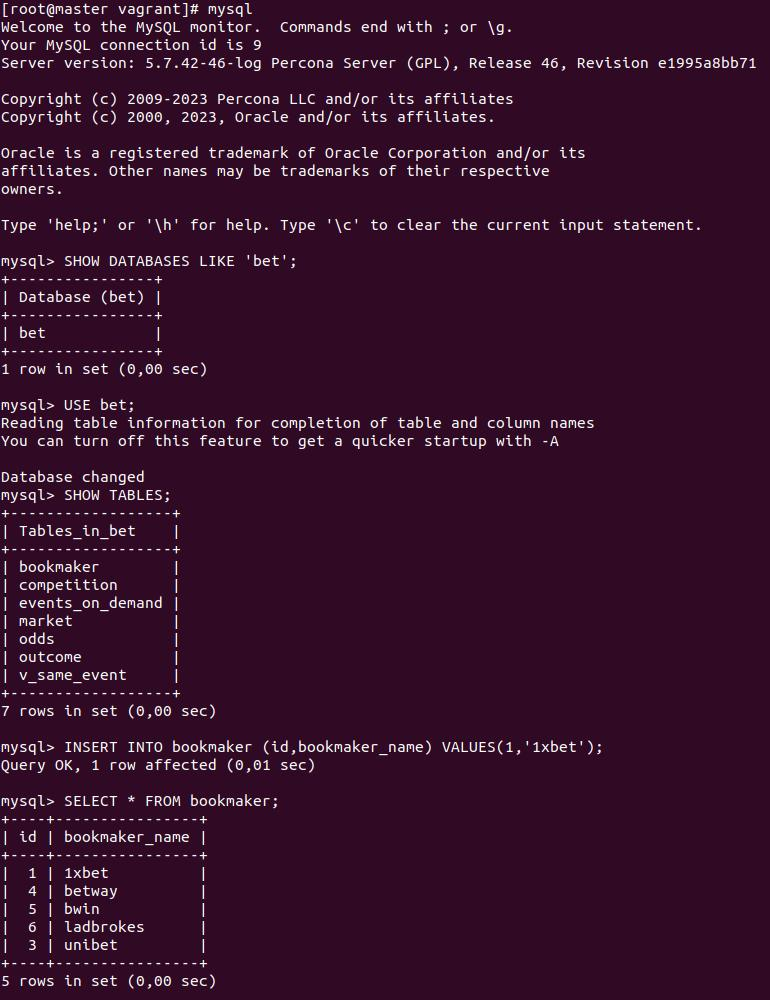
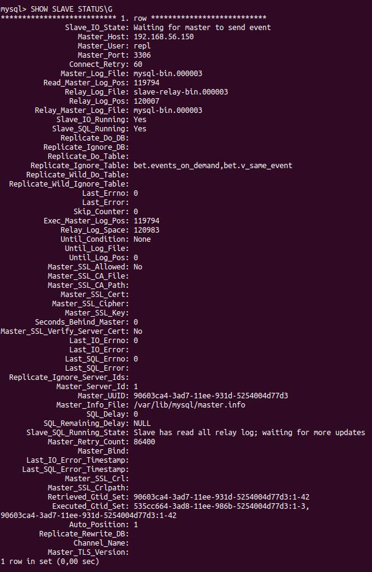
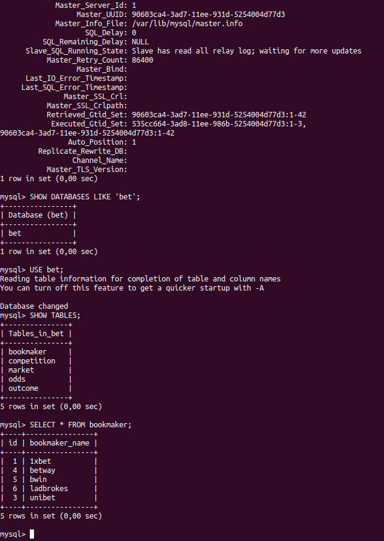

## lab43_MySQL
### С помощью Vagrant + Ansible развернут стенд: mysql master + slave

-----------------------------------------------------------------------------------------------------------------------

* __[Скрипт Vagrantfile:](./Vagrantfile)__
<details>

```
ENV['VAGRANT_SERVER_URL'] = 'https://vagrant.elab.pro'
MACHINES = {
  :master => {
        :box_name => "centos/7",
        :ip_addr => '192.168.56.150'
  },
  :slave => {
        :box_name => "centos/7",
        :ip_addr => '192.168.56.151'
  }
}

Vagrant.configure("2") do |config|

  MACHINES.each do |boxname, boxconfig|

      config.vm.define boxname do |box|

          box.vm.box = boxconfig[:box_name]
          box.vm.host_name = boxname.to_s

          #box.vm.network "forwarded_port", guest: 3260, host: 3260+offset

          box.vm.network "private_network", ip: boxconfig[:ip_addr]

          box.vm.provider :virtualbox do |vb|
            vb.customize ["modifyvm", :id, "--memory", "1024"]
          end

          box.vm.provision :shell do |s|
             s.inline = 'mkdir -p ~root/.ssh; cp ~vagrant/.ssh/auth* ~root/.ssh'
          end

      end
  end

  config.vm.provision "ansible" do |ansible|
  ansible.verbose = "vvv"
  ansible.playbook = "ansible/playbook.yml"
  ansible.become = "true"
  end

end

```  

</details>
<br>

* __[Ansible playbook для роли master:](./ansible/roles/master/tasks/main.yml)__
<details>

```
---
#Отключение SElinux до перезагрузки
- name: disable SElinux now
  shell: setenforce 0

#Установка временной зоны Европа/Москва
- name: Set up timezone
  timezone:
    name: "Europe/Moscow"

#Включение firewalld
- name: enable firewalld
  service:
   name: firewalld
   state: started
   enabled: true   

# Открываем нужные порты
- name: allow ports 
  firewalld:
   port: "{{ item }}"
   permanent: yes
   immediate: yes
   state: enabled
  loop:
   - 3306/tcp
   - 22/tcp
   - 53/tcp

- name: Add Percona
  yum:
    name: https://repo.percona.com/yum/percona-release-latest.noarch.rpm
    state: present

- name: Install Percona
  yum:
    name:
      - Percona-Server-server-57
      - percona-toolkit
      - percona-xtrabackup
      - MySQL-python
    state: present

- name: Copy configs
  copy:
    src: "{{ item }}"
    dest: /etc/my.cnf.d/
  with_fileglob: "*.cnf"

- name: Stop MySQL
  service:
    name: mysqld
    state: stopped

#Отключаем проверку разрешений
- name: Set vars
  command: systemctl set-environment MYSQLD_OPTS="--skip-grant-tables"

- name: Start MySQL
  service:
    name: mysqld
    state: started

#обновляем пароль      
- name: Sql query
  command:  mysql -u root --execute="UPDATE mysql.user SET authentication_string = PASSWORD('{{ mysql_root_password }}') WHERE User = 'root' AND Host = 'localhost';"

#перечитываем привелегии    
- name: Sql query flush
  command:  mysql -u root --execute="FLUSH PRIVILEGES"

- name: Stop MySQL
  service:
    name: mysqld
    state: stopped

- name: Unset vars
  command: systemctl unset-environment MYSQLD_OPTS

- name: Start MySQL
  service:
    name: mysqld
    state: started
    enabled: yes

- name: Copy .my.cnf file to the root folder
  template:
    src: root.my.cnf.j2
    dest: /root/.my.cnf
    owner: root
    group: root
    mode: 0600

#Устанавливаем пароль     
- name: Set root password
  command: mysql --connect-expired-password --batch --execute="{{ item }}"
  with_items:
    - ALTER USER 'root'@'localhost' IDENTIFIED BY '{{ mysql_root_password }}';

- name: Create DB user with all privileges
  mysql_user:
    login_user: root
    login_password: "{{ mysql_root_password }}"
    name: "{{ replication_user }}"
    password: "{{ replication_password }}"
    host: '%'
    priv: '*.*:ALL'
    state: present

- name: Create DB bet
  mysql_db:
    login_user: root
    login_password: "{{ mysql_root_password }}"
    name: bet
    state: present

#импортируем бд из файла
- name: Import bet database
  mysql_db:
    login_user: root
    login_password: "{{ mysql_root_password }}"
    name: bet
    state: import
    target: /vagrant/ansible/bet.dmp

```        
</details>
<br>

* __[Ansible playbook для роли slave:](./ansible/roles/slave/tasks/main.yml)__
<details>

```
---
#Отключение SElinux до перезагрузки
- name: disable SElinux now
  shell: setenforce 0

#Установка временной зоны Европа/Москва
- name: Set up timezone
  timezone:
    name: "Europe/Moscow"

#Включение firewalld 
- name: enable firewalld
  service:
   name: firewalld
   state: started
   enabled: true  

# Открываем нужные порты
- name: allow ports
  firewalld:
   port: "{{ item }}"
   permanent: yes
   immediate: yes
   state: enabled
  loop:
   - 3306/tcp
   - 22/tcp
   - 53/tcp

- name: Add Percona
  yum:
    name: https://repo.percona.com/yum/percona-release-latest.noarch.rpm
    state: present

- name: Install Percona
  yum:
    name:
      - Percona-Server-server-57
      - percona-toolkit
      - percona-xtrabackup
      - MySQL-python
    state: present

- name: Copy configs
  copy:
    src: "{{ item }}"
    dest: /etc/my.cnf.d/
  with_fileglob: "*.cnf"

- name: Stop MySQL
  service:
    name: mysqld
    state: stopped

#Отключаем проверку разрешений      
- name: Set vars
  command: systemctl set-environment MYSQLD_OPTS="--skip-grant-tables"

- name: Start MySQL
  service:
    name: mysqld
    state: started

#обновляем пароль     
- name: Sql query
  command:  mysql -u root --execute="UPDATE mysql.user SET authentication_string = PASSWORD('{{ mysql_root_password }}') WHERE User = 'root' AND Host = 'localhost';"

#перечитываем привелегии    
- name: Sql query flush
  command:  mysql -u root --execute="FLUSH PRIVILEGES"

- name: Stop MySQL
  service:
    name: mysqld
    state: stopped

- name: Unset vars
  command: systemctl unset-environment MYSQLD_OPTS

- name: Start MySQL
  service:
    name: mysqld
    state: started
    enabled: yes

- name: Copy .my.cnf file to the root folder
  template:
    src: root.my.cnf.j2
    dest: /root/.my.cnf
    owner: root
    group: root
    mode: 0600

#Устанавливаем пароль      
- name: Set root pass
  command: mysql --connect-expired-password --batch --execute="{{ item }}"
  with_items:
    - ALTER USER 'root'@'localhost' IDENTIFIED BY '{{ mysql_root_password }}';

#Пеереключаемся на slave
- name: Change to slave
  shell: mysql -uroot -p'{{ mysql_root_password }}' -e 'CHANGE MASTER TO MASTER_HOST="192.168.56.150", MASTER_PORT = 3306, MASTER_USER="{{ replication_user }}", MASTER_PASSWORD="{{ replication_password }}", MASTER_AUTO_POSITION=1;'

- name: Start slave
  shell: mysql -uroot -p'{{ mysql_root_password }}' -e 'START SLAVE;'

```
</details>
<br>

* __Репликация работает:__
<br>
* master:
 
 

* На slave: mysql> SHOW SLAVE STATUS\G
Исключены:
```
Replicate_Ignore_Table: bet.events_on_demand,bet.v_same_event
```



* На slave:mysql> SELECT * FROM bookmaker;



* __Логи выполнения:__

[Лог запуска стенда](./vagrant_up.txt)
