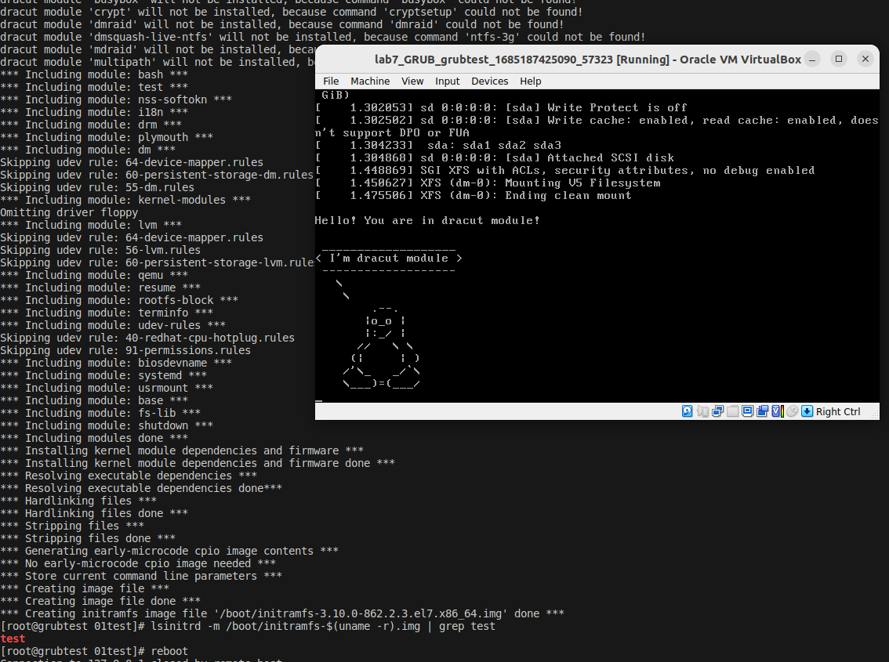

Работа с  GRUB
===============
 
**1. Попасть в систему без пароля несколькими способами.**


**2. Установить систему с LVM, после чего переименовать VG.**
Исходное состояние:
```
[root@grubtest vagrant]# pvs
  PV         VG       Fmt  Attr PSize   PFree
  /dev/sda3  OtusRoot lvm2 a--  <38.97g    0 
[root@grubtest vagrant]# vgs
  VG       #PV #LV #SN Attr   VSize   VFree
  OtusRoot   1   2   0 wz--n- <38.97g    0 
[root@grubtest vagrant]# lvs
  LV       VG       Attr       LSize   Pool Origin Data%  Meta%  Move Log Cpy%Sync Convert
  LogVol00 OtusRoot -wi-ao---- <37.47g                                                    
  LogVol01 OtusRoot -wi-ao----   1.50g    
```
Переименовываем VG:
```                                                
[root@grubtest vagrant]# vgrename OtusRoot RenamedVG
  Volume group "OtusRoot" successfully renamed to "RenamedVG"
```
Проверка и замена старого имени VG (OtusRoot) на новое (RenamedVG файлов)  /etc/fstab, /etc/default/grub, /boot/grub2/grub.cfg
```  
[root@grubtest vagrant]# grep OtusRoot /etc/fstab
/dev/mapper/OtusRoot-LogVol00 /                       xfs     defaults        0 0
/dev/mapper/OtusRoot-LogVol01 swap                    swap    defaults        0 0
[root@grubtest vagrant]# sed -i 's/OtusRoot/RenamedVG/g' /etc/fstab
[root@grubtest vagrant]# sed -i 's/OtusRoot/RenamedVG/g' /etc/default/grub
[root@grubtest vagrant]# sed -i 's/OtusRoot/RenamedVG/g' /boot/grub2/grub.cfg
[root@grubtest vagrant]# grep RenamedVG /boot/grub2/grub.cfg
        linux16 /vmlinuz-3.10.0-862.2.3.el7.x86_64 root=/dev/mapper/RenamedVG-LogVol00 ro no_timer_check console=tty0 console=ttyS0,115200n8 net.ifnames=0 biosdevname=0 elevator=noop crashkernel=auto rd.lvm.lv=RenamedVG/LogVol00 rd.lvm.lv=RenamedVG/LogVol01 rhgb quiet 
[root@grubtest vagrant]# mkinitrd -f -v /boot/initramfs-$(uname -r).img $(uname -r)
```
После перезагрузки:
```
[vagrant@grubtest ~]$ sudo su
[root@grubtest vagrant]# pvs
  PV         VG        Fmt  Attr PSize   PFree
  /dev/sda3  RenamedVG lvm2 a--  <38.97g    0 
[root@grubtest vagrant]# vgs
  VG        #PV #LV #SN Attr   VSize   VFree
  RenamedVG   1   2   0 wz--n- <38.97g    0 
[root@grubtest vagrant]# lvs
  LV       VG        Attr       LSize   Pool Origin Data%  Meta%  Move Log Cpy%Sync Convert
  LogVol00 RenamedVG -wi-ao---- <37.47g                                                    
  LogVol01 RenamedVG -wi-ao----   1.50g        
```
Лог:
[vg_rename.txt](vg_rename.txt)


**3. Добавить модуль в initrd**
Создаю директорию для хранения модуля:
```
mkdir /usr/lib/dracut/modules.d/01test

```
Скачиваю скрипты:
```
[root@grubtest 01test]# curl -o module-setup.sh https://gist.githubusercontent.com/lalbrekht/e51b2580b47bb5a150bd1a002f16ae85/raw/80060b7b300e193c187bbcda4d8fdf0e1c066af9/gistfile1.txt
  % Total    % Received % Xferd  Average Speed   Time    Time     Time  Current
                                 Dload  Upload   Total   Spent    Left  Speed
100   126  100   126    0     0    355      0 --:--:-- --:--:-- --:--:--   356

[root@grubtest 01test]# curl -o test.sh https://gist.githubusercontent.com/lalbrekht/ac45d7a6c6856baea348e64fac43faf0/raw/69598efd5c603df310097b52019dc979e2cb342d/gistfile1.txt
  % Total    % Received % Xferd  Average Speed   Time    Time     Time  Current
                                 Dload  Upload   Total   Spent    Left  Speed
100   334  100   334    0     0   1050      0 --:--:-- --:--:-- --:--:--  1053

```
Пересборка образа initrd:
```
[root@grubtest 01test]# mkinitrd -f -v /boot/initramfs-$(uname -r).img $(uname -r)
Executing: /sbin/dracut -f -v /boot/initramfs-3.10.0-862.2.3.el7.x86_64.img 3.10.0-862.2.3.el7.x86_64
```
Проверка модуля и перезагрузка:
```
[root@grubtest 01test]# lsinitrd -m /boot/initramfs-$(uname -r).img | grep test
test
[root@grubtest 01test]# reboot
```
При загрузке выключены rghb и quiet пауза на 10 секунд и пингвин в выводе терминала:



Лог:
[vg_renamed_done.txt](vg_renamed_done.txt)
